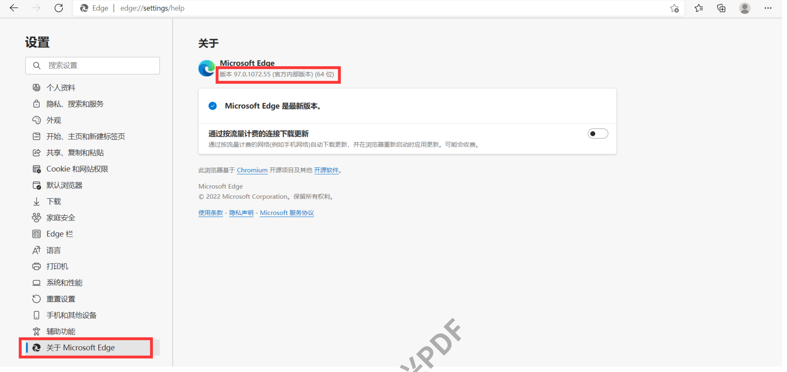
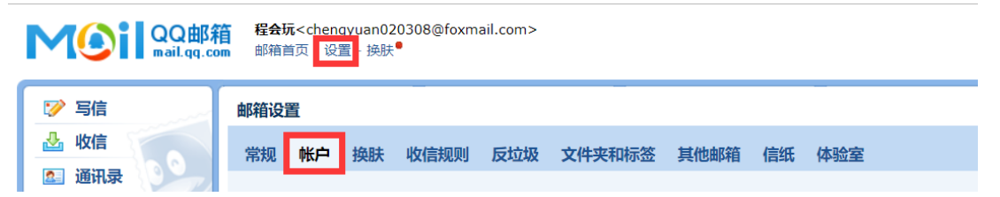
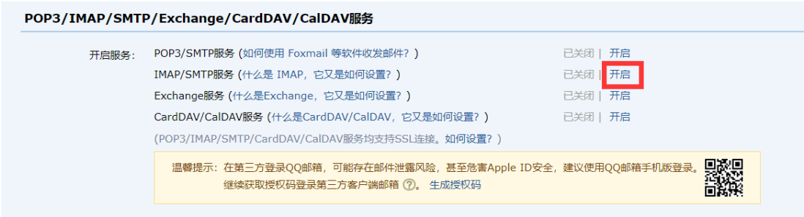
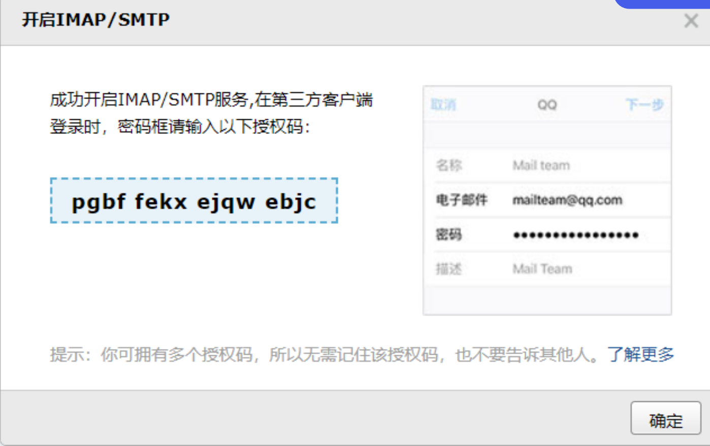
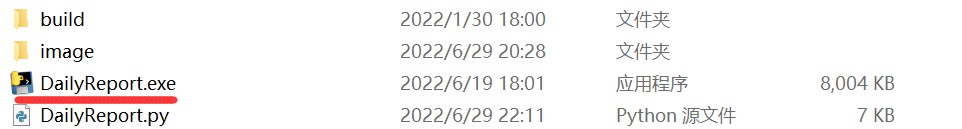

# HITDailyReport 2.0
**哈工大每日上报+出校申请**  

## Version: 1.0
通过edge浏览器自动上报，并且将上报成功截图发送给自己的qq邮箱   

## Version: 2.0
### 更新内容
- 增加了出校申请功能
- 修复了一些卡住的bug
- 增加了一个日志记录文件,每日成功上报之后再次进入程序会提示并退出，可以选择是否出校申请，可以选择是否邮件提醒
- 完善配置说明，并且加入到readme文件中
- 删除了配置说明.pdf和.vscoede

# 配置说明
## 1.下载第三方库
	pip install selenium
## 2.下载edge驱动文件:
https://developer.microsoft.com/en-us/microsoft-edge/tools/webdriver/

下载之后解压即可，记住存放路径

注意查看版本，下载对应版本的驱动器：



## 3.开启qq邮箱设置：

如果不想要发送邮件，可以跳过这一步



然后下拉



按照要求发送短信，记住密码



## 4.文件配置：
### 修改DaliyReport.py的14-21行
```python
#需要修改
stu_number = ['1234567890']  # 学号
stu_password = ['password']  # 密码
stu_name = 'name'  # 附件加上同学名字首写字母前缀，用以区分。不必须
sender = '12345678@qq.com'
receiver = '12345678@qq.com'
password_email = 'pgbffekxejqwebjc' #授权码
# 输入webdriver放置的路径
driver_url = r"A:\\MyEdgeDriver\\msedgedriver.exe"
Reason='吃饭'
```
更改自己学工平台的学号和密码，以及qq邮箱

其中stu_name是提交成功截图（存放在当前路径下的image文件夹里面）命名的一部分，可随意更改。

password_email是qq邮箱开通SMTP之后的授权码（不是邮箱密码），driver_url是下载的驱动器的路径

### 修改dateRecorder.txt
```
2022-06-29
需要出校申请
需要发送邮件
```
其中第一行填写最后一次成功的每日上报的日期（这里可以不改动）

第二行填写“需要出校申请”/"不需要出校申请"

第三行填写“需要发送邮件”/"不需要发送邮件"

## 5. 每日自动上报、申请
### 1.打包
如果你的电脑对.py文件的默认打开方式是运行，那么可以不需要打包

如果不是，可以使用pyinstaller工具

```
pip install pyinstaller
pyinstaller -F ./DailyReport.py
```
默认生成在从dist文件夹中，拖出来到和DailyReport.py同一个文件夹即可


### 2.自动运行
#### 这里可以设置开机自启动
将DailyReport.exe生成快捷方式

放入开机自启动的文件夹中即可

一般的路径为：C:\Users\【用户名】\AppData\Roaming\Microsoft\Windows\Start Menu\Programs\Startup
#### 也可以定一个计划任务让它每天定时启动
具体可以百度“win10怎么设置定时任务”